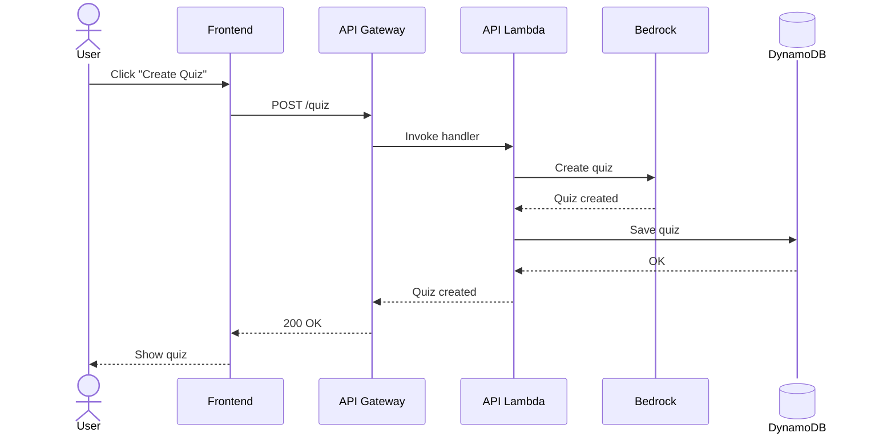
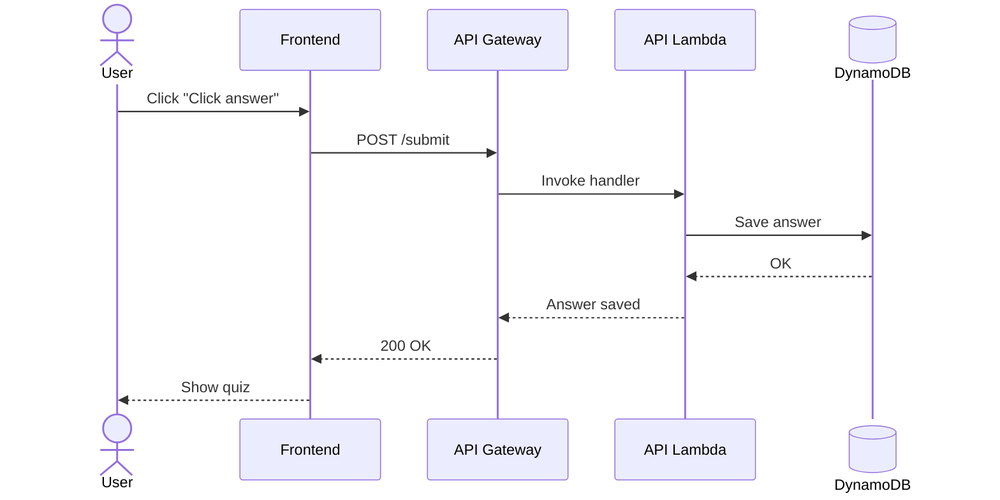
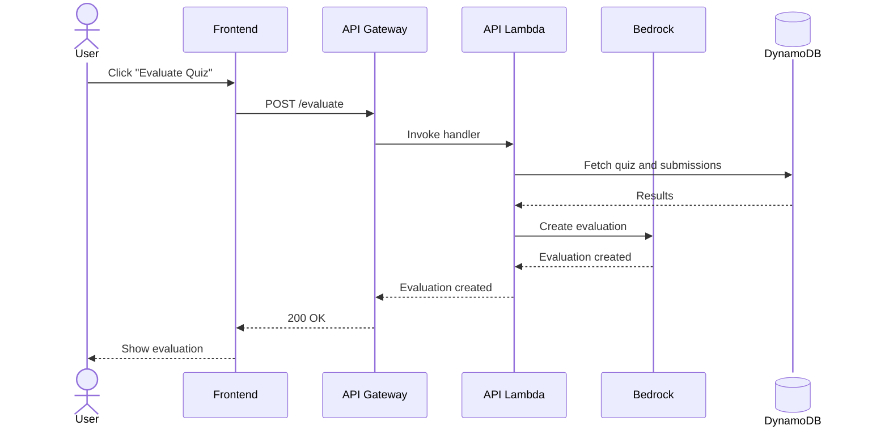

# AI Build Day - Quiz Generator

## Features

### Create quiz



### Submit answer



### Evaluate submission



## Endpoints

- Create quiz: `POST /create`
  - body: `CreateQuizRequest`
  - response: `CreateQuizResponse`
- Submit all answers: `POST /submit`
  - body: SubmitAnswersRequest
  - response: `null`
- Evaluate quiz: `POST /evaluate`
  - body: `null`
  - response: `string`

Create quiz

```TypeScript
// Request DTO
interface CreateQuizRequest {
  count: number; // typically 20
  topic: string; // has to be validated semantically to be safe
  difficulty: "junior" | "medior" | "senior"
}

// Response DTO
interface CreateQuizResponse {
  questions: Question[];
}

interface Question {
  text: string;
  answers: string[];
}
```

Submit all answers

```TypeScript
// Request DTO
type SubmitAnswersRequest = Record<string, string>;

```

## DynamoDB Structure

Table name: `QuizApp`

Indeces: PK+SK

Quizzes:

- `QUIZ#<guid>` + `META`: Meta info
- `QUIZ#<guid>` + `Q01`: 1st question
- :
- `QUIZ#<guid>` + `Q20`: 20th question

Answers

- `QUIZ#<guid>` + `SUB`: Summary
- `QUIZ#<guid>` + `SUB#91`: 1st answer
- :
- `QUIZ#<guid>` + `SUB#91`: 20th answer

## CloudFormation

Name: Diligent AI Build Day 2026
Codename: `dil-ai-build-day-2026`

### Stacks

- WebSiteBucket (frontend)
- ApiFunction (backend)
- DynamoDB (database)
- Bedrock (AI modell)

## Local development

### Prerequisites

**1. SAM CLI**

```bash
# macOS (Homebrew)
brew install aws-sam-cli

# Verify
sam --version
```

Or use the [official installer](https://docs.aws.amazon.com/serverless-application-model/latest/developerguide/serverless-sam-cli-install.html) (macOS `.pkg` for arm64 or x86_64).

**2. Docker**

SAM local runs Lambda in Docker containers. Verify Docker is running:

```bash
docker --version
docker info
```

If Docker is not installed or not running:

- **macOS**: [Docker Desktop](https://docs.docker.com/desktop/install/mac-install/) or [Colima](https://github.com/abiosoft/colima) (`brew install colima docker` then `colima start`)
- **Linux**: `sudo apt install docker.io` (Ubuntu) or equivalent, then `sudo systemctl start docker`

**3. AWS CLI** (optional for local health check)

Required for `sam deploy` and for handlers that use DynamoDB/Bedrock (create, submit, evaluate). The health check works without it.

```bash
aws configure
```

### Run the API locally

From the **project root**:

```bash
pnpm api:dev
```

This runs `sam build` and `sam local start-api`. If you use [Colima](https://github.com/abiosoft/colima), the script sets `DOCKER_HOST` automatically so SAM can find the Docker socket.

To run the commands directly:

```bash
sam build
sam local start-api
```

The API runs at `http://localhost:3000`. Test the health check:

```bash
curl http://localhost:3000/healthz
```

### Run the frontend

In a second terminal:

```bash
pnpm ui dev
```

Open `http://localhost:5173`, go to `/health`, and click "Check API Health". The frontend uses `http://localhost:3000` by default in dev.

### Troubleshooting: 502 / "signal: killed" / CORS

If the health check returns 502 or you see "Runtime exited with error: signal: killed" in the terminal, the Lambda container is likely running out of memory during init. The template sets `MemorySize: 512` to avoid this. If it persists, try 1024.

The CORS error in the browser appears because when the Lambda crashes, SAM returns a 502 without CORS headers. Fixing the Lambda crash resolves both.

### Troubleshooting: "container runtime" error with Colima

If `sam local start-api` fails with "Do you have Docker or Finch installed and running?" even though `docker ps` works, SAM may not be finding Colima's Docker socket.

**Preferred:** Use `pnpm api:dev`, which sets `DOCKER_HOST` automatically when the Colima socket is present.

**Manual:** If you run `sam` directly, set `DOCKER_HOST` before the command:

```bash
export DOCKER_HOST="unix://$HOME/.colima/default/docker.sock"
sam local start-api
```

Alternatively, add to `~/.zshrc` or `~/.zshenv` for persistence.

---

## Deployment

### Backend (SAM)

```bash
sam build
sam deploy
```

## Technologies

### Development

- [Mermaid, diagrams and visualizations](https://mermaid.ai/)
- [AWS API Event Source](https://github.com/awslabs/serverless-application-model/blob/master/versions/2016-10-31.md#api)
- [AWS Function Resource](https://github.com/awslabs/serverless-application-model/blob/master/versions/2016-10-31.md#awsserverlessfunction)
