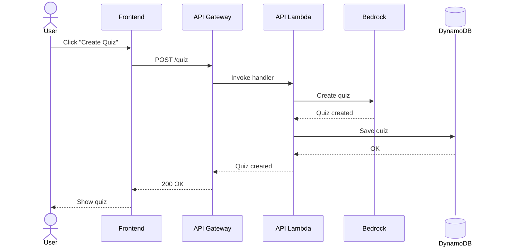
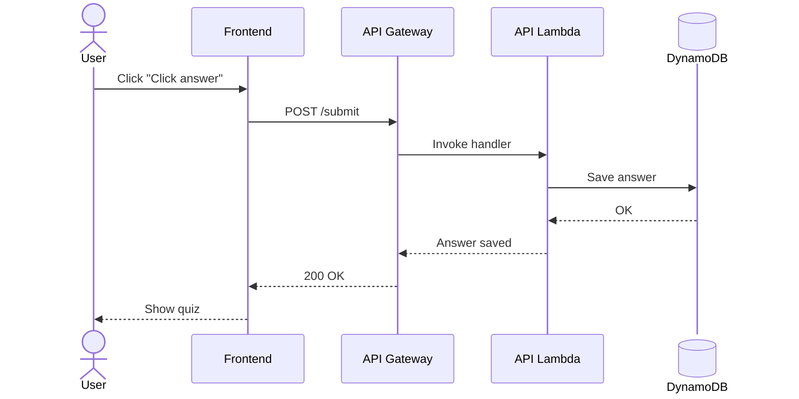
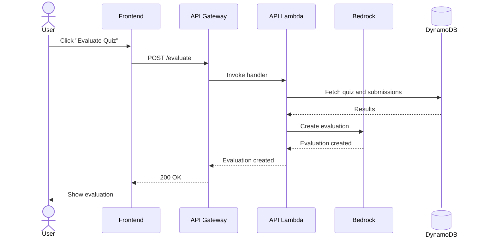

# AI Build Day - Quiz Generator

## Features

### Create quiz



### Submit answer



### Evaluate submission



## Endpoints

- Create quiz: `POST /create`
  - body: `CreateQuizRequest`
  - response: `CreateQuizResponse`
- Submit all answers: `POST /submit`
  - body: SubmitAnswersRequest
  - response: `null`
- Evaluate quiz: `POST /evaluate`
  - body: `null`
  - response: `string`

Create quiz

```TypeScript
// Request DTO
interface CreateQuizRequest {
  count: number; // typically 20
  topic: string; // has to be validated semantically to be safe
  difficulty: "junior" | "medior" | "senior"
}

// Response DTO
interface CreateQuizResponse {
  questions: Question[];
}

interface Question {
  text: string;
  answers: string[];
}
```

Submit all answers

```TypeScript
// Request DTO
type SubmitAnswersRequest = Record<string, string>;

```

## DynamoDB Structure

Table name: `QuizApp`

Indeces: PK+SK

Quizzes:

- `QUIZ#<guid>` + `META`: Meta info
- `QUIZ#<guid>` + `Q01`: 1st question
- :
- `QUIZ#<guid>` + `Q20`: 20th question

Answers

- `QUIZ#<guid>` + `SUB`: Summary
- `QUIZ#<guid>` + `SUB#91`: 1st answer
- :
- `QUIZ#<guid>` + `SUB#91`: 20th answer

## CloudFormation

Name: Diligent AI Build Day 2026
Codename: `dil-ai-build-day-2026`

### Stacks

- WebSiteBucket (frontend)
- ApiFunction (backend)
- DynamoDB (database)
- Bedrock (AI modell)

## Technologies

### Development

- [Mermaid, diagrams and visualizations](https://mermaid.ai/)
- [AWS API Event Source](https://github.com/awslabs/serverless-application-model/blob/master/versions/2016-10-31.md#api)
- [AWS Function Resource](https://github.com/awslabs/serverless-application-model/blob/master/versions/2016-10-31.md#awsserverlessfunction)
